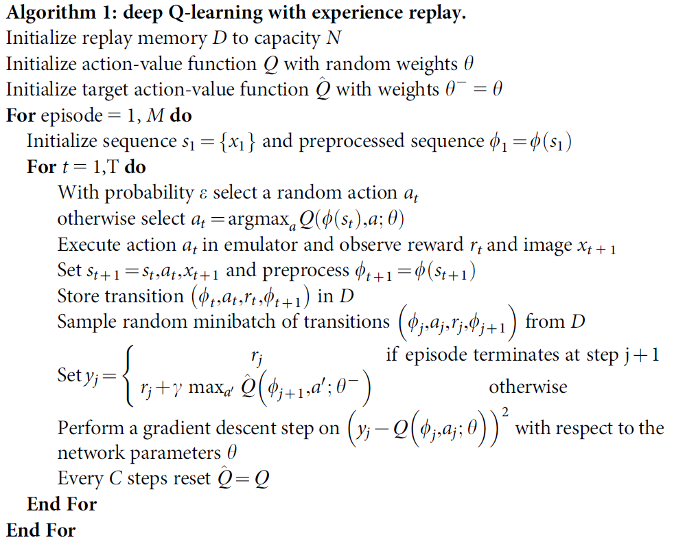
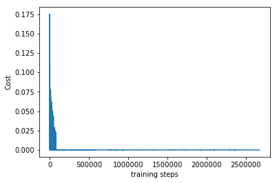
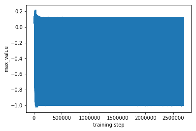
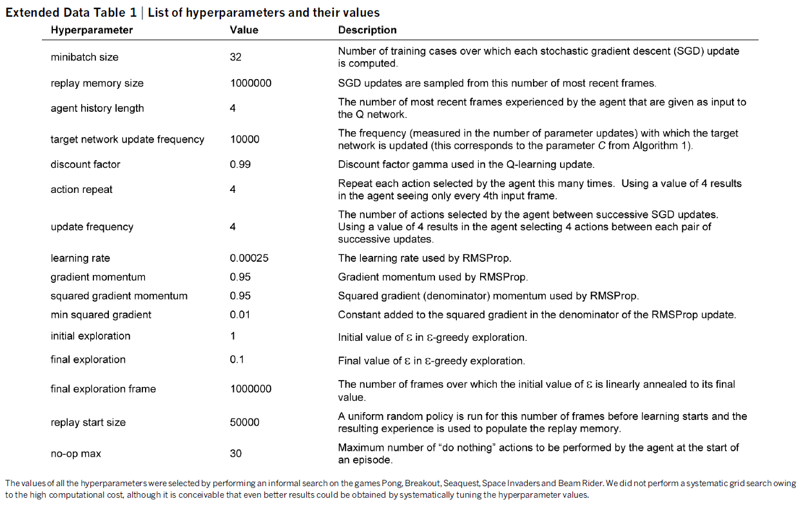

# FlappyBird in DQN with Target Network


## Overview

This repo is based on [yenchenlin/DeepLearningFlappyBird](https://github.com/yenchenlin/DeepLearningFlappyBird)

I do these things on his repo:
* **add freezing target network in DQN algorithm**
* **rewrite the network using tflearn,a wrapper of tensorflow (you can also write it only with tensorflow)**
* **write a function for human to play the game(space key to fly, doing nothing to fall down)**
## Installation Dependencies:
* Python3
* TensorFlow >= 1.1.0
* tflearn
* pygame
* OpenCV-Python

## How to Install
* my system is win10, linux/mac is a little defferent but easier
```
pip install tensorflow
pip install tflearn
pip install opencv-python
```
  pygame click here:　 [PyGame](https://blog.csdn.net/qq_33166080/article/details/68928563)
  tensorflow gpu click here:　[Windows10 64位下安装TensorFlow - 官方原生GPU版安装](https://blog.csdn.net/goodshot/article/details/61926838)

## How to Run
* Play the game by yourself
```
python DQN_with_target_network.py --human_play True
```
* Test the model
```
python DQN_with_target_network.py
```
* Continue training
```
python DQN_with_target_network.py --train True
```
## DQN Algorithm
This algorithm is on paper [Human-level control through deep reinforcement learning ](https://www.ncbi.nlm.nih.gov/pubmed/25719670)

 <br>

* The only difference in this code is that I don't fix the C=10000,and adjust it with the network's cost.
 
 ## Details
  Environment,network architecture and the training parameter nearly all the same with [yenchenlin/DeepLearningFlappyBird](https://github.com/yenchenlin/DeepLearningFlappyBird)
  * preprocess
  
  
  * network
   
   
  * game
  I cancel the FPS restriction when training so that it can run faster depending on your computer.
  

## Train Tricks
We know that RL algorithms always get better performance at the cost of stability, sometimes we can't get a good result even with the same code. It is highly based on the parameters of the algorithm,network and even the random seed. When we update some states' action for a more accurate Q value,other actions may get worse,and this is always unavoidable. So,when we find the pictures as follows, we should be aware that the network may has fallen into a bad circumstance and can't improve anymore.
* Unbalanced samples


We can see from the cost picture that the network fits well, the max_value picture shows the Q value of the best action has converged and range in a section with very low max Q value(-1~0.1). When you train from scratch, you may encounter with this and it is because of Unbalanced samples. The bird always fly to the top of the game screen and finally bump the pipe in a clumsy way. So, the memory D saves all these data and doesn't konw there is a better way to go further and thinks it's the end state of the MDP problem. In addition,the network updates time after time to get lower and lower Q value, at the same time the best action does not change because of BP algorithm and unbalanced samples,in other words,the update is useless to choice a better action.<br>

For example,a state S has two actions: 0 and 1. In fact,0 is a better action but now with a lower Q value,let's assume that Q(0)=0.2,Q(1)=0.3 here. And unfortunately the memory D now has all data about action 1 with reward -1,so the BP algorithm can only base the action 1's data to update the network. The memory D thinks the action 1's value should be -1,but knows nothing about action 0,so he updates action 1's Q value by amending it to -1,but at the same time action 0's Q value has been changed to -1.1 by chance and is still lower than action 1, so the update is useless to choice a better action and this is the reason caused by BP algorithm and unbalanced samples.<br>

How to solve it? The most stupid but always effective method is restarting it to initialize the parameters(better initialize the network do nothing).There must be some better ways need more study.

## Differences between with/without Target Network
* [yenchenlin/DeepLearningFlappyBird's](https://github.com/yenchenlin/DeepLearningFlappyBird) code is mainly based on paper [Playing Atari with Deep Reinforcement Learning](https://arxiv.org/abs/1312.5602v1) (without target network),and this repo is based on [Human-level control through deep reinforcement learning ](https://www.ncbi.nlm.nih.gov/pubmed/25719670) (with target network)
* these two ways are all effective,training speed are all slow(depends on many causes and too hard too say which is faster). 
* With target network, the network's cost can be control in a lower level and perform more stable and less likely to fluctuate wildly(but this problem still exists)

## Future Work Can Try
There are still some works may improve the performance
* Training it for a longer time. This model reaches more than 5,000 score when training about 2 days on 4 million frames with COREi7 and 1080Ti(an enough long time for the bird to fly before bumping the pipe), far less than paper's 50 million frames and 38 days.
* Memory D is only 50,000 here in total,and in paper it's 1 million most recent frames. A huge memory can save more data to fit a more stable network and also with longer time.
* Frame-skipping technique. Now the network can take an action at every frame, it's very flexible for the network to adjust its state but also extend action/state space which needs more data to fit,and also will take more time for the network to compute and then output an action. In the original paper, it is said as follow:<br> More precisely, the agent sees and selects actions on every kth frame instead of every frame, and its last action is repeated on skipped frames. Because running the emulator forward for one step requires much less computation than having the agent select an action, this technique allows the agent to play roughly k times more games without significantly increasing the runtime.We use k=4 for all games.
* We use Adam to update network in this game,and RMSProp is used in original paper. I think they are all okay,but maybe there are some diffenrences?
* More details are in the following picture,and maybe you can find some more improvements.<br>

